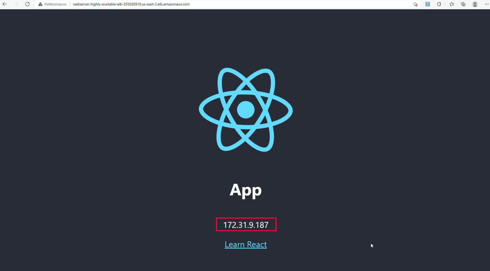

# Create test instances with load balancer


## Steps
- Using provider AWS and region us-east-2
```
provider "aws" {
  region = "us-east-2"
}
```

- Get available data centers in the selected region
```
data "aws_availability_zones" "available" {}
```

- Using ubuntu the latest image
```
data "aws_ami" "ubuntu" {
  owners      = ["099720109477"]
  most_recent = true
  filter {
    name   = "name"
    values = ["ubuntu/images/hvm-ssd/ubuntu-focal-20.04-amd64-server-*"]
  }
}
```
- Creating firewall rules for 22, 80 ports
```
resource "aws_security_group" "web" {
  name = "Dynamic Security Group"

  dynamic "ingress" {
    for_each = ["22", "80"]
    content {
      from_port   = ingress.value
      to_port     = ingress.value
      protocol    = "tcp"
      cidr_blocks = ["0.0.0.0/0"]
    }
  }
  egress {
    from_port   = 0
    to_port     = 0
    protocol    = "-1"
    cidr_blocks = ["0.0.0.0/0"]
  }

  tags = {
    Name  = "Web access for Application"
  }
}

```
- Creating Launch configuration. Where:
    - instance_type - type of vm in selected region (CPU, RAM, etc.)
    - image_id - image described earlier
    - key_name  - SSH key-pair imported into the AWS console
    - security_groups - security group described earlier
    - user_data - script which executing while instance creating
```
resource "aws_launch_configuration" "web" {
  name_prefix     = "Web-server-"
  image_id        = data.aws_ami.ubuntu.id
  instance_type   = "t3.micro"
  security_groups = [aws_security_group.web.id]
  user_data       = file("user_data.sh")
  key_name = "id_rsa_t"
  # while updating first create new instance then destroy old instance
  lifecycle {
    create_before_destroy = true
  }
}
```

- Creating Elastic Load Balancer. Target healthy check by 80 port 
```
resource "aws_elb" "web" {
  name               = "WebServer-Highly-Available-ELB"
  availability_zones = [data.aws_availability_zones.available.names[0], data.aws_availability_zones.available.names[1]]
  security_groups    = [aws_security_group.web.id]
  listener {
    lb_port           = 80
    lb_protocol       = "http"
    instance_port     = 80
    instance_protocol = "http"
  }
  health_check {
    healthy_threshold   = 2
    unhealthy_threshold = 2
    timeout             = 3
    target              = "HTTP:80/"
    interval            = 10
  }
  tags = {
    Name = "WebServer-Highly-Available-ELB"
  }
}
```

- Creating subnets 
```
resource "aws_default_subnet" "availability_zone_1" {
  availability_zone = data.aws_availability_zones.available.names[0]
}

resource "aws_default_subnet" "availability_zone_2" {
  availability_zone = data.aws_availability_zones.available.names[1]
}
```

- Output dns name in console 
```
output "web_loadbalancer_url" {
  value = aws_elb.web.dns_name
}
```


